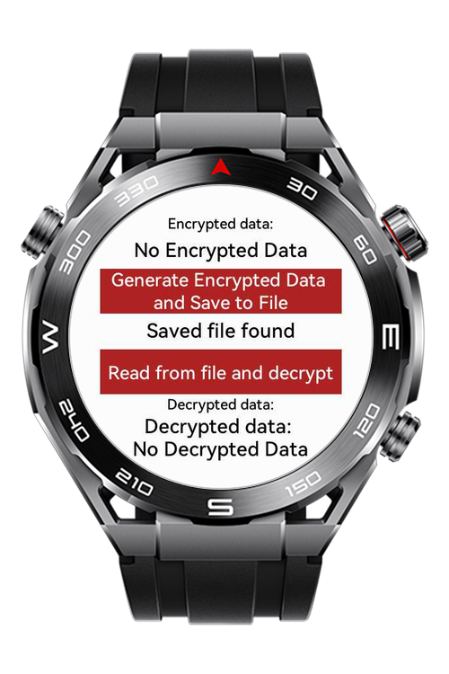

> **Note:** To access all shared projects, get information about environment setup, and view other guides, please visit [Explore-In-HMOS-Wearable Index](https://github.com/Explore-In-HMOS-Wearable/hmos-index).

# Encrypted File Store

This app is a demonstration of RSA encryption and decryption on HarmonyOS. It includes key generation, encryption of data, saving encrypted data to a file, and reading and decrypting the data from the file.

# Preview
<div>
    
    
    
</div>

# Use Cases
- Encrypt data and save it to the file system
- Read encrypted data from a file and decrypt it
- Use HUKS API for key generation and management
- Demonstrate asynchronous callback handling in HarmonyOS
- Modular and maintainable code structure

# Technology

## Stack

- **Language**: JavaScript (Huawei LiteWearable)
- **Tools**: Huawei DevEco Studio IDE 5.1.1.840
- **Libraries**:
  - [`@system.file`](https://developer.huawei.com/consumer/en/doc/harmonyos-references/js-apis-system-storage)
  - [`@ohos.security.huks`](https://developer.huawei.com/consumer/en/doc/harmonyos-references/js-apis-huks)
  - [`@system.app`](https://developer.huawei.com/consumer/en/doc/harmonyos-references/js-apis-system-app)

## Diagrams - Process
1. User clicks "Generate Encrypted Data and Save to File"
2. App checks if the RSA key exists
3. If not, generates a new RSA key
4. Encrypts the data using the key
5. Saves the encrypted data to a file
6. User clicks "Read from file and decrypt"
7. Reads the encrypted data from the file
8. Decrypts the data and displays it

# Directory Structure
```
└───MainAbility
    │   app.js
    │
    ├───crypto
    │       rsa.js
    │
    ├───i18n
    │       en-US.json
    │       zh-CN.json
    │
    ├───pages
    │   └───index
    │           index.css
    │           index.hml
    │           index.js
    │
    └───store
            store.js
```


# Constraints and Restrictions
## Supported Devices
- Huawei Sport (Lite) Watch GT 4/5/6
- Huawei Sport (Lite) GT4/5 Pro
- Huawei Sport (Lite) Fit 3/4
- Huawei Sport (Lite) D2
- Huawei Sport (Lite) Ultimate

# License
**Encrypted File Store** is released under the MIT License.  
See the [LICENSE](/LICENSE) file for details.